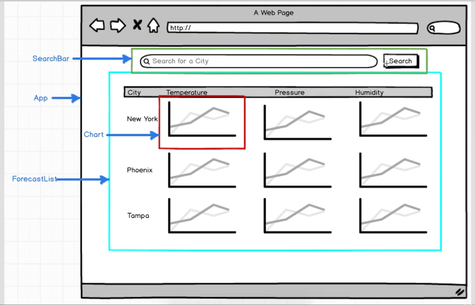

## weather-redux-app
Weather app build in React and Redux based on tutorial on [Redux](https://www.udemy.com/react-redux/)

### Wireframe

### References

- [full stack redux tutorial](http://teropa.info/blog/2015/09/10/full-stack-redux-tutorial.html)
- [react-redux](https://github.com/reactjs/react-redux)
- [redux](http://redux.js.org/index.html)
- [Video React-Redux with Dan Abramov](https://www.youtube.com/watch?v=VJ38wSFbM3A)
- [egghead redux tutorial](https://egghead.io/series/getting-started-with-redux)
- [dwyl redux](https://github.com/dwyl/learn-redux)
